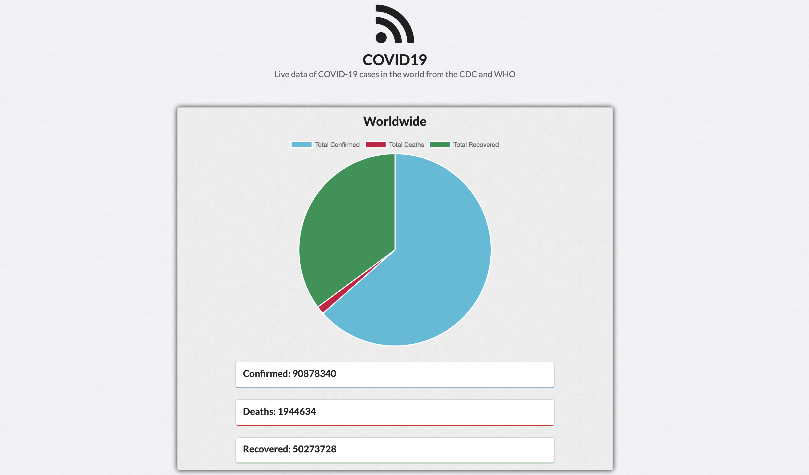
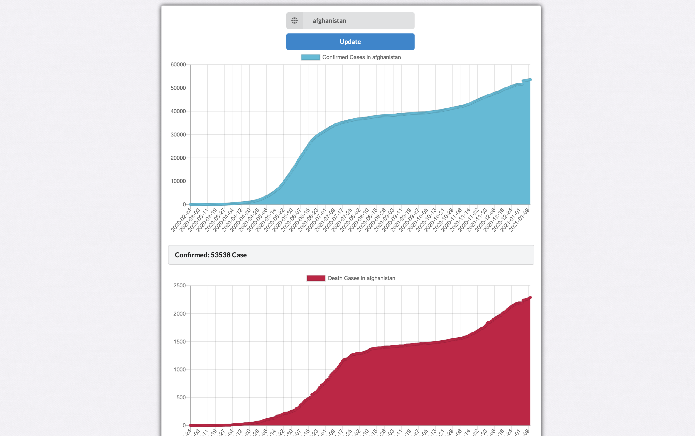

# COVID19-Dashboard

## Getting Started
``` 
git clone https://github.com/YazanAlmatar99/covid19-reactjs.git
```
``` 
cd covid19-reactjs && npm install 
```
``` 
npm start
```

### You can see the Project running on http://covid19.yazanalmatar.com (it might take a little while to load due to free plan on Heroku, if it says App Crashed just refresh the page and it will work!)

### Built using ReactJS and fully customized to run on Desktop and Mobile



